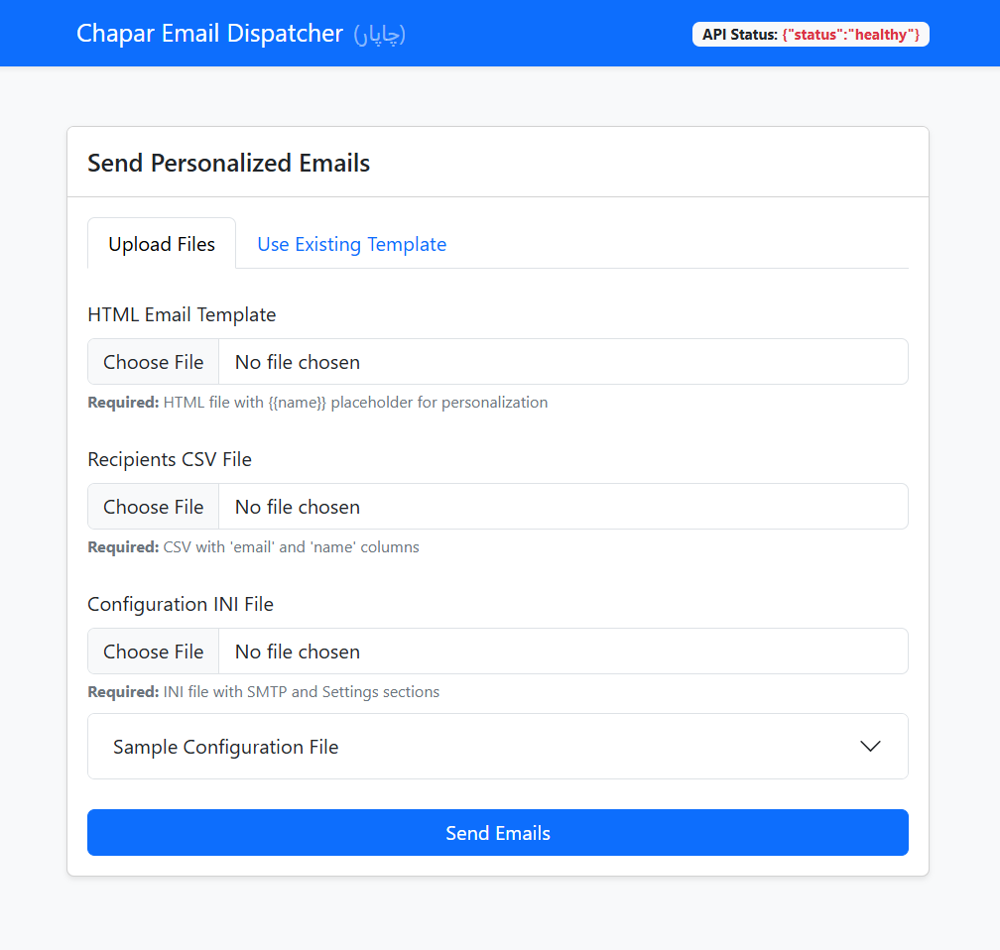
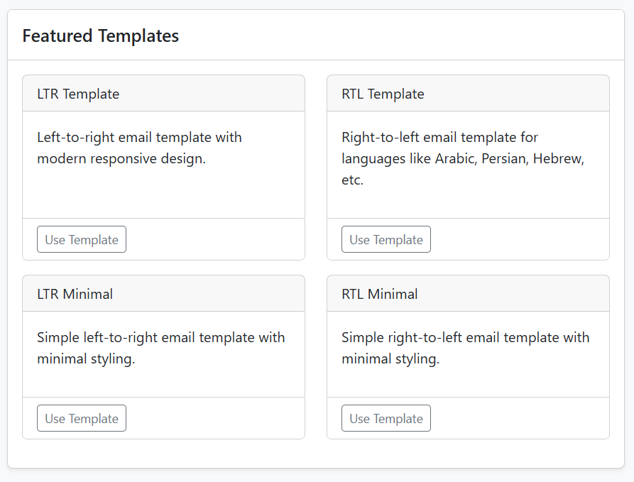
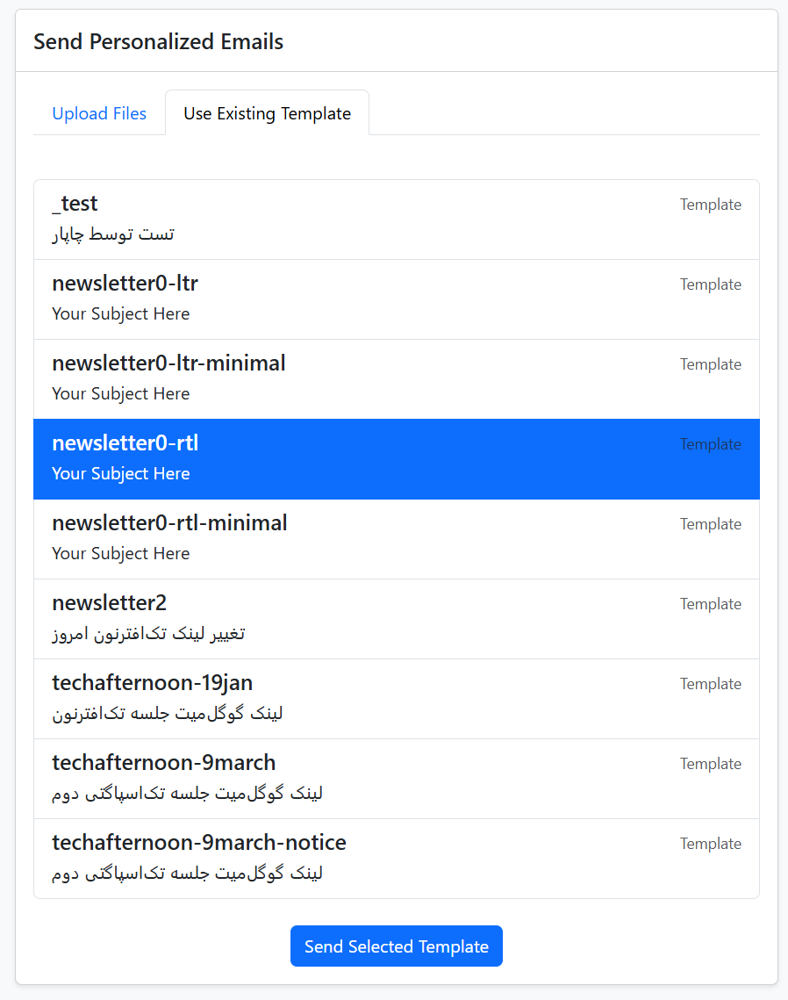

# Chapar (چاپار)

Chapar (چاپار) is a Python-based tool for sending personalized HTML emails effortlessly. Inspired by the Persian word "Chapar," which refers to the ancient postal couriers who swiftly delivered messages across distances, this project modernizes the art of communication, enabling efficient and customizable email delivery for your needs.

## Features

- **Web Interface**: Modern, responsive UI built with Bootstrap 5.3.x and HTMX
- **API Support**: RESTful API for sending emails and managing templates
- **Template Management**: Use existing templates or upload your own
- **Personalization**: Customize emails with recipient names
- **Secure Connections**: Supports SSL and TLS encryption
- **RTL & LTR Support**: Templates for both right-to-left and left-to-right languages
- **Send Control**: Configure intervals between email sends
- **Validation**: File type, email format, and content validation
- **Docker Support**: Easy deployment with Docker

## Quick Start

### CLI Usage

Run the script with a folder containing your `email_template.html`, `recipients.csv`, and `config.ini`:

```bash
python src/chapar.py newsletter0-ltr
```
## Web Interface
Start the web server:
```bash
python src/chapar_api.py
```

Then open http://localhost:5000 in your browser to access the web interface.

### Web Interface
The web interface allows you to:

Upload Files: Upload your HTML template, recipients CSV, and config INI files
Use Existing Templates: Select from available template folders
Preview Templates: View sample templates (LTR, RTL, minimal versions)
Send Emails: Dispatch emails with a single click





----
### API Endpoints
* GET /api/health: Health check endpoint
* GET /api/templates: List available templates
* POST /api/send: Send emails using uploaded files
* POST /api/run-template: Run an existing template
* GET /templates/<template_folder>: Get files for a specific template
### Template Structure
Each template folder should contain:

* email_template.html: HTML email template with {{name}} placeholders
* recipients.csv: CSV file with email and name columns
* config.ini: Configuration file with SMTP and Settings sections
### Configuration File (config.ini)
```
[SMTP]
Host = smtp.example.com
Port = 587  # 587 for TLS, 465 for SSL
Email = your_email@example.com
Password = your_password
Subject = Your Subject Here
DisplayName = Your Name

[Settings]
Interval = 0  # Seconds between sending emails
LogLevel = detailed  # Options: none, job, detailed
```
### Docker Usage
Building the Docker Image
```
docker build -t chapar .
```
Running the CLI Version
```
docker run -v $(pwd)/src/newsletter0-ltr:/app/newsletter0-ltr chapar newsletter0-ltr
```
Running the Web Server
```
docker run -p 5000:5000 -v $(pwd)/src:/app chapar python chapar_api.py
```
Dependencies
* Python 3.9+
* Flask (for API)
* Werkzeug
* configparser
* python-magic (for file validation)
* Bootstrap 5.3.x (included via CDN)
* HTMX (included via CDN)
### Installation
1. Clone the repository:
```
git clone https://github.com/aminmesbahi/chapar.git
cd chapar
```
2. Install requirements:
```
pip install -r src/requirements.txt
```
Running Tests
1. Install REST Client extension in VS Code

2. Open chapar_api_test.http in VS Code

3. click "Send Request" above each test case to execute:

* Health check endpoint
* Email sending with valid files
* Error handling scenarios
### Security Notes
* Always use secure SMTP connections (Port 587 for TLS or 465 for SSL)
* Keep your SMTP credentials secure and never commit them to version control
* Consider using environment variables for sensitive information

## Subscriber CSV Merger

The project includes a utility script [`src/merger.py`](src/merger.py) to merge and deduplicate subscriber CSV files.

### Usage

To merge all subscriber CSV files in the `src/subscribers/` folder (e.g. `000_*.csv`, `001_*.csv`, ...):

```bash
python src/merger.py src
```

You can specify a range of files by index (e.g. only `002_*` to `004_*`):

```bash
python src/merger.py src --start 2 --end 4
```

### How it works

- Reads all CSV files in the `src/subscribers/` folder matching the index range.
- Merges rows by email (case-insensitive).
- For each email, the latest (by Timestamp) row is kept, but if any row for that email has `"true"` for `subscrube` or `subscribe_survey`, the merged result will have `"true"` for that field.
- Writes the merged result to [`src/subscribers.csv`](src/subscribers.csv).

### Configuration

You can customize column names and file names by editing [`src/merger.ini`](src/merger.ini):

```ini
[Columns]
csv_file = subscribers
output_file = subscribers.csv
email_column = Email
updates_column = subscrube
survey_column = subscribe_survey
start_index = 000
end_index = 005
```

- `start_index` and `end_index` control which files are included (by prefix number).
- The script will always look for files in the `subscribers` subfolder of the given folder.

---